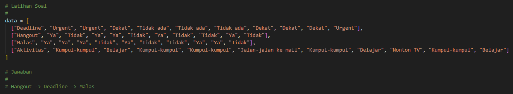

<!-- LOGO -->
<br />
<div align="center">
  <h3 align="center">ID3 BEST ATTRIBUTE SOLVER</h3>

  <p align="center">
    by Ditra Amadia
    <br />
    <br />
  </p>
</div>


<!-- ABOUT THE PROJECT -->
## About The Project

[![Product Name Screen Shot][app-preview]](https://github.com/ditramadia/id3-best-attribute-solver)

Best attribute solver using ID3 algorithm for constructing decision tree. 

### Built With
* [![Python][Python.py]][Python-url]
<br/>
<br/>

<!-- GETTING STARTED -->
## Getting Started

### Installation
1. Clone the repo
   ```sh
   git clone https://github.com/ditramadia/id3-best-attribute-solver.git
   ```
2. Go to the repository root folder `id3-best-attribute-solver`
   ```sh
   cd id3-best-attribute-solver
   ```
3. Run the program `main.py`
   ```sh
   python main.py
   ```
<br/>
<br/>

<!-- USAGE -->
## Usage

1. Add your data into `data.py`
    <br/> 
    <br/> 
    <br/> 
    <br/> 

2. Run the main program
    <br/> 
    <br/> 
    <br/> 
    <br/> 

<br/>
<br/>

<!-- MARKDOWN LINKS & IMAGES -->
<!-- https://www.markdownguide.org/basic-syntax/#reference-style-links -->
[app-preview]: public/app-preview.png
[Python.py]: https://img.shields.io/badge/python-3670A0?style=for-the-badge&logo=python&logoColor=ffdd54
[Python-url]: https://www.python.org/
